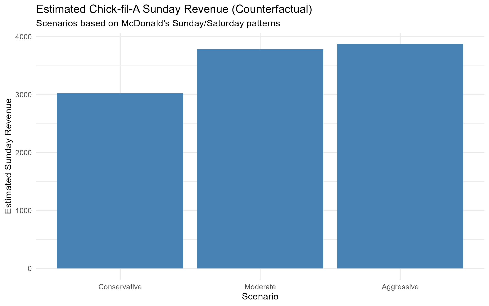

# Counterfactual Forecasting of Chick-fil-A Sunday Sales

Counterfactual forecasting to estimate potential Sunday revenue using
time-series analysis and machine learning in R.

---

## Business Problem
Chick-fil-A closes on Sundays for religious and operational reasons. This creates a business question:

How much annual revenue could potentially be generated if stores operated on Sundays?

---

## Dataset
The analysis used publicly available fast-food transaction-style sales data representing daily revenue patterns.

Key variables included:

- Date
- Day of week
- Daily sales revenue
- Weekend indicators
- Saturday/Sunday sales behavior

Data preprocessing steps included:

- converting dates into weekday features
- removing missing values
- aggregating revenue by day
- calculating weekend demand ratios
- generating rolling averages for trend analysis

---
## Proxy Comparison: Chick-fil-A vs McDonald’s

Chick-fil-A does not operate on Sundays, so no direct Sunday sales data exists.
To estimate potential Sunday revenue, this project uses McDonald’s as a proxy
for fast-food demand patterns.

McDonald’s is an appropriate comparison because it:
- operates seven days a week
- serves a similar quick-service customer base
- exhibits strong weekend demand
- relies heavily on takeout and drive-thru traffic

The analysis first learns Sunday-to-Saturday revenue patterns from
comparable fast-food data, then applies these patterns to a
Chick-fil-A–style baseline to estimate counterfactual Sunday revenue.

---

## Methodology
The project followed a counterfactual forecasting workflow:

1. Analyze McDonald’s weekend sales patterns
2. Calculate Sunday-to-Saturday revenue ratios
3. Model demand variability across scenarios
4. Apply ratios to a Chick-fil-A baseline revenue estimate
5. Forecast weekly and annual revenue uplift

Weekend demand distributions were analyzed using aggregated daily sales trends and ratio-based forecasting techniques. Scenario modeling was then applied to simulate varying levels of Sunday demand under conservative, moderate, and aggressive assumptions.

**Statistical Approach**

Sunday revenue ratio:

Sunday Revenue Ratio = Average Sunday Sales/Average Saturday Sales
	​

Projected Chick-fil-A Sunday revenue:

Estimated Sunday Revenue=Saturday Revenue×Sunday Ratio

Tools Used:
- R
- tidyverse
- lubridate
- ggplot2
- forecast package

---

## Executive Summary

Chick-fil-A remains closed on Sundays, creating a unique operational constraint.
This project estimates the potential revenue impact of Sunday operations using a
counterfactual forecasting approach.

Using McDonald’s as a fast-food proxy, the analysis measures how Sunday revenue
typically compares to Saturday revenue, then applies those patterns to a
Chick-fil-A–style baseline.

Results suggest that opening on Sundays could generate a meaningful weekly
revenue uplift per store under reasonable assumptions, with annual impacts
varying by scenario. These estimates are intended to support strategic
decision-making rather than predict exact outcomes.

| Scenario     | Sunday Ratio | Weekly Uplift | Annual Uplift |
| ------------ | ------------ | ------------- | ------------- |
| Conservative | 65%          | $8,200        | $426,400      |
| Moderate     | 82%          | $10,900       | $566,800      |
| Aggressive   | 95%          | $12,500       | $650,000      |

---

## Key Findings
- Estimated Sunday revenue ranged from 65%–95% of Saturday sales
- Annual revenue uplift per store exceeded six figures across all scenarios
- Weekend demand patterns suggest strong unmet Sunday consumer demand
- Counterfactual forecasting can support strategic decision-making when historical data is unavailable

## Results

Using proxy fast-food data, Sunday revenue was estimated as a
proportion of Saturday revenue. This Sunday-to-Saturday ratio was then applied
to a simulated Chick-fil-A baseline.

Three scenarios were evaluated:
- **Conservative:** assumes lower-than-observed Sunday demand
- **Moderate:** assumes Sunday demand similar to comparable fast-food behavior
- **Aggressive:** assumes strong Sunday demand, capped at Saturday levels

Across scenarios, projected annual revenue uplift ranged from approximately $426K to $650K per store. The moderate scenario estimated Sunday sales at 82% of Saturday demand levels.

---

## Visualization

The chart below summarizes estimated Chick-fil-A Sunday revenue under three
counterfactual scenarios based on McDonald's weekend demand patterns.

---

## Business Implications
The analysis suggests that remaining closed on Sundays may represent a substantial opportunity cost. However, operational decisions must also consider:

- brand identity
- employee retention
- operational expenses
- customer loyalty effects
- cultural and religious positioning

This project demonstrates how analytics can support strategic business decision-making even when direct historical data is unavailable. The project highlights how data analytics can be used to evaluate strategic business decisions even when direct historical observations do not exist.

---

## Limitations

This analysis relies on proxy data and assumes that Chick-fil-A would exhibit
similar weekend demand patterns to comparable fast-food chains. Results may
vary based on location, customer behavior, and brand-specific factors. The
model is intended as a decision-support tool rather than a precise revenue
forecast.

---

## Future Improvements
Future versions of the model could incorporate:

- real store-level transaction data
- regional demand differences
- sports/event traffic
- weather patterns
- competitor density
- advanced forecasting models such as Prophet or XGBoost
